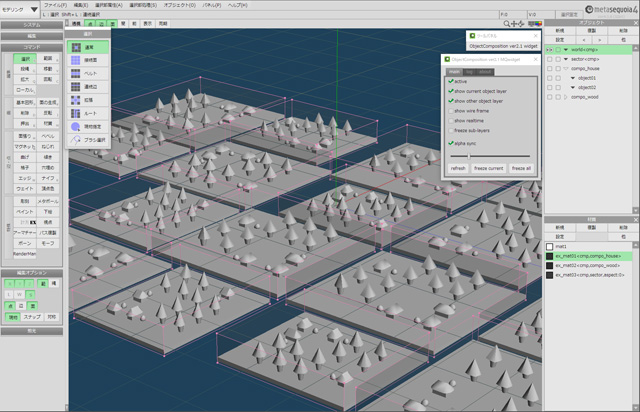

# metasequoia station plugin "ObjectComposition"

Metasequoia station plugin "ObjectCompoisition" のソースコードです。\
win32(x86),x64両対応。\
コンパイルはVisualStudio2015で行っています。

## plugin (release binary)

以下よりダウンロードしてください。\
<a hreaf="http://d.hatena.ne.jp/Ko-Ta/20170709/p1">http://d.hatena.ne.jp/Ko-Ta/20170709/p1</a>

## how to compile

付属readme.txtをご覧ください。\
環境ごとにローカルリモートデバッグの設定が必要になります。

## license

zlibライセンス。\
ご自由に改変可能です。

